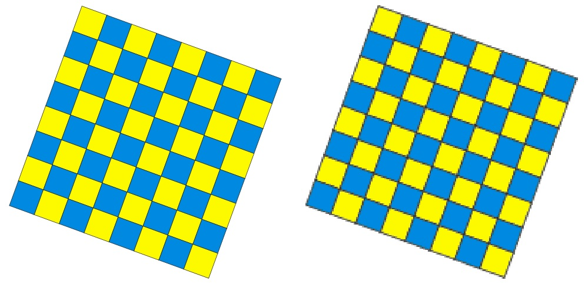
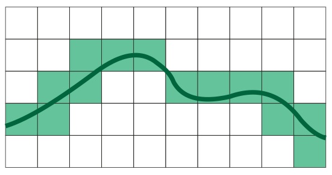
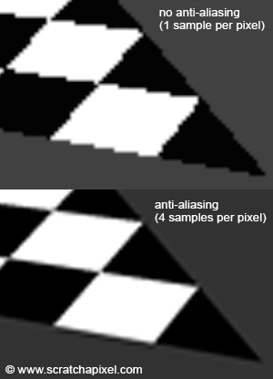
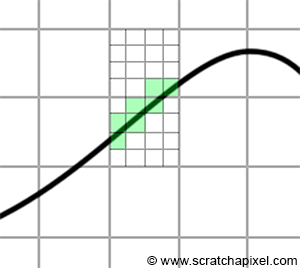
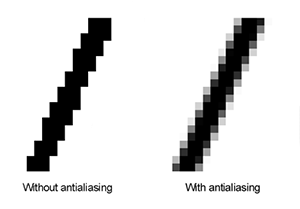
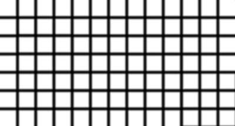
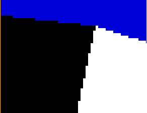
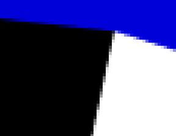

# ANTIALIASING APLICADO A FIGURAS POLIGONALES

### MICHAEL ANDRÉS MURCIA CONTRERAS

H:

## CONTENIDO

1. Marco Teórico
2. Ilustración del Problema
3. Ilustración de la Solución
4. Antecedentes
5. Demo
6. Conclusiones
7. Bibliografía

H:

## MARCO TEÓRICO

Las bases para el algoritmo de rasterización son:
* Buffer Z también conocido como Buffer Profundo
* Interpolación Profunda

H:

## ILUSTRACIÓN DEL PROBLEMA

Apreciación de aristas irregulares o bordes escalonados (Jaggies)

H:

## ILUSTRACIÓN DEL PROBLEMA

Superficies Continuas representados en Pixeles como elementos discretos

H:

## ILUSTRACIÓN DE LA SOLUCIÓN

SuperSampling: Antialiasing por sobremuestra (En toda la imagen)

H:

## ILUSTRACIÓN DE LA SOLUCIÓN

MultiSampling: Antialiasing por sobremuestra (En bordes solamente)

H:

## ILUSTRACIÓN DE LA SOLUCIÓN

El Antialiasing hace uso de algoritmos de efecto borroso

H:

## ANTECEDENTES

Algoritmo de Bresenham: Trazado de líneas en dispositivos gráficos

H:

## ANTECEDENTES

CoverageSampling: Versión de MultiSampling de NVIDIA optimizada

  

H:

## DEMO
[URL del Script](https://github.com/mamurciac)

H:

## BIBLIOGRAFÍA

<small>Link del Repositorio: <a href="https://github.com/mamurciac/reveal.js">https://github.com/mamurciac/reveal.js</a></small>
<small>Reveal.js's Template forked at <a href="https://github.com/hakimel/reveal.js/">https://github.com/hakimel/reveal.js</a>. By <a href="http://hakim.se">Hakim El Hattab and his contributors</a></small>
<small>Rasterization: a Practical Implementation. Scratchapixel 2.0. Recuperado de <a href="https://www.scratchapixel.com/lessons/3d-basic-rendering/rasterization-practical-implementation">https://www.scratchapixel.com/lessons/3d-basic-rendering/rasterization-practical-implementation</a></small>
<small>Quagliozzi, E. Z Buffering. PDA - FX. Recuperado de <a href="http://pda-fx.net/pagedoc.php?id=4&lg=EN">http://pda-fx.net/pagedoc.php?id=4&amp;lg=EN</a></small>
<small>23 de Septiembre de 2017. Algoritmo de Bresenham. Wikipedia. Recuperado de <a href="https://es.wikipedia.org/wiki/Algoritmo_de_Bresenham">https://es.wikipedia.org/wiki/Algoritmo_de_Bresenham></a></small>

H: